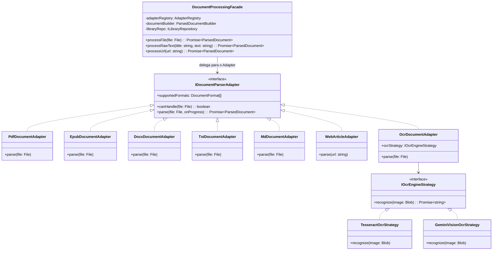

# SDD 00: Arquitetura Unificada de Múltiplos Documentos — VivaVoz

> **Status:** Aprovado / Em Especificação  
> **Versão:** 1.2.0  
> **Padrões Arquiteturais:** MVVM, Catálogo Completo Gang of Four (GoF), SOLID & Clean Architecture  
> **Data:** Agosto de 2026  

---

## 1. Visão Geral e Objetivos

O **VivaVoz** expande seu ecossistema para suportar a ingestão, processamento, indexação e reprodução de múltiplos formatos de documentos (.pdf, .epub, .docx, .txt, .md, URLs da web, .pptx, .odt e imagens com OCR).

Para garantir **máxima manutenibilidade, desacoplamento, testabilidade e escalabilidade**, a arquitetura do projeto adota formalmente:
- **Padrão Arquitetural MVVM (Model-View-ViewModel)**.
- **Padrões de Projeto do Gang of Four (GoF)** em suas categorias Criacionais, Estruturais e Comportamentais (Facade, Adapter, Builder, Strategy, Factory, Composite, Observer, Decorator, Command, State, etc.).
- **Princípios SOLID** e **Clean Architecture** (separação estrita entre Modelos de domínio, UseCases/Services, Adapters de I/O e Views).

---

## 2. Padrão Arquitetural MVVM (Model-View-ViewModel)

```mermaid
graph LR
    subgraph ViewLayer["View (Componentes React / UI)"]
        Dropzone["DocumentDropzone"]
        Player["PlayerControls & TranscriptView"]
        Library["LibraryView"]
        PasteDialog["QuickPasteDialog"]
    end

    subgraph ViewModelLayer["ViewModel (Custom Hooks)"]
        UploaderVM["useDocumentUploaderViewModel"]
        ReaderVM["useDocumentReaderViewModel"]
        LibraryVM["useLibraryViewModel"]
    end

    subgraph DomainLayer["Model & Domain Services / Use Cases"]
        Facade["DocumentProcessingFacade"]
        UseCases["ExtractDocumentUseCase<br/>SplitSentencesService<br/>CalculateMetricsService"]
        Entities["ParsedDocument<br/>DocumentChapter<br/>DocumentMetadata"]
    end

    ViewLayer <-->|Events / State Binding| ViewModelLayer
    ViewModelLayer -->|Invokes| DomainLayer
```



### 2.1. Responsabilidades das Camadas MVVM:
- **Model (`src/lib/types/`, `src/lib/domain/`):**
  - Entidades de domínio puras (`ParsedDocument`, `DocumentChapter`, `DocumentMetadata`).
  - Imutáveis, sem efeitos colaterais e sem acoplamento com React, DOM ou Next.js.
- **ViewModel (`src/hooks/`):**
  - Custom Hooks que encapsulam o estado da UI, loading/progresso, erros e comandos.
  - Expõe propriedades reativas e métodos limpos para a View (ex: `handleFilesDrop()`, `jumpToChapter()`, `filterByFormat()`).
  - Invoca a Facade e os UseCases.
- **View (`src/components/`):**
  - Componentes React puros focados exclusivamente em renderização visual, acessibilidade (WebMCP) e captura de interações do usuário.
  - Proibido conter regras de parsing de arquivos ou regras de negócio diretas.

---

## 3. Catálogo de Padrões de Projeto do Gang of Four (GoF)

Sempre que houver necessidade técnica no projeto, devem ser aplicados os padrões GoF adequados:

### 3.1. Padrões Criacionais (Creational Patterns)
- **Builder (`ParsedDocumentBuilder`):** Construção estruturada e fluente do agregado `ParsedDocument`, garantindo validação de invariantes, metadados calculados e consistência de índices.
- **Factory Method & Abstract Factory (`AdapterRegistry` / `DocumentParserFactory`):** Centralização da instanciação e resolução dinâmica do extrator compatível com base no tipo MIME ou extensão do arquivo.
- **Singleton:** Para serviços de ciclo de vida único (instâncias de IndexedDB, gateways de áudio e conexões locais).

### 3.2. Padrões Estruturais (Structural Patterns)
- **Facade (`DocumentProcessingFacade`):** Ponto único e simplificado de entrada que orquestra todo o subsistema de extração, sanitização, geração de metadados e persistência para a UI/ViewModel.
- **Adapter (`IDocumentParserAdapter`):** Padronização polimórfica de diferentes bibliotecas e formatos de arquivos (`PdfDocumentAdapter`, `EpubDocumentAdapter`, `DocxDocumentAdapter`, `TxtDocumentAdapter`, `MdDocumentAdapter`, `WebArticleAdapter`, `OcrDocumentAdapter`).
- **Composite:** Modela a hierarquia de documentos compostos por seções, capítulos, subcapítulos e parágrafos.
- **Decorator:** Envolve adapters ou streams de áudio para adicionar funcionalidades transversais (ex: logging de performance, telemetria de tokens, cache de extração) sem alterar a classe base.

### 3.3. Padrões Comportamentais (Behavioral Patterns)
- **Strategy (`IOcrEngineStrategy`, `ITtsEngineStrategy`):** Algoritmos intercambiáveis em tempo de execução (ex: OCR Tesseract local vs. Gemini Vision Cloud; sintetizador Web Speech vs. ElevenLabs).
- **Observer / Pub-Sub:** Comunicação desacoplada de eventos de progresso de upload, streaming de áudio e avanço de sentenças.
- **Command:** Encapsulamento de comandos do leitor (Play, Pause, Próxima Frase, Salto de Capítulo) facilitando atalhos de teclado e histórico de ações.
- **Chain of Responsibility:** Encadeamento de sanitizadores de texto (remoção de tags, formatação de URLs, normalização de caracteres especiais).
- **State & Memento:** Máquina de estados do player e persistência do ponto de leitura para restauração de sessão.

---

## 4. Diagrama de Classes e Arquitetura GoF



---

## 5. Princípios SOLID Aplicados

1. **S (Single Responsibility):** Cada adapter/classe trata exclusivamente de uma única responsabilidade de domínio ou I/O.
2. **O (Open/Closed):** O sistema é aberto para extensão (novos formatos via novos Adapters/Strategies) e fechado para modificação de código já testado.
3. **L (Liskov Substitution):** Qualquer implementação de interface (ex: `IDocumentParserAdapter`) pode substituir outra sem quebrar o comportamento do consumidor.
4. **I (Interface Segregation):** Interfaces pequenas, focadas e coesas (`IDocumentParserAdapter`, `IProgressNotifier`, `ICoverExtractor`).
5. **D (Dependency Inversion):** Módulos de alto nível (ViewModels, Facades, UseCases) dependem de abstrações/interfaces, nunca de implementações concretas.

---

## 6. Estrutura de Diretórios Proposta

```
src/
  ├── components/pdf-reader/         # [VIEW] Componentes React puros
  │   ├── document-dropzone.tsx
  │   ├── library.tsx
  │   ├── player-controls.tsx
  │   └── quick-paste-dialog.tsx
  ├── hooks/                         # [VIEWMODEL] Hooks de apresentação
  │   ├── use-document-uploader.ts
  │   ├── use-document-reader.ts
  │   └── use-library.ts
  └── lib/
      ├── domain/                    # [MODEL & SERVICES] Entidades e UseCases puros
      │   ├── document.types.ts
      │   ├── document-builder.ts    # [BUILDER]
      │   ├── sentence-splitter.service.ts
      │   └── reading-metrics.service.ts
      ├── facade/                    # [FACADE] Orquestração central
      │   └── document-processing.facade.ts
      ├── parsers/                   # [ADAPTERS & FACTORIES]
      │   ├── adapter.interface.ts
      │   ├── adapter-registry.ts    # [FACTORY]
      │   ├── pdf.adapter.ts
      │   ├── epub.adapter.ts
      │   ├── docx.adapter.ts
      │   ├── txt.adapter.ts
      │   ├── md.adapter.ts
      │   ├── web-article.adapter.ts
      │   └── ocr.adapter.ts         # [STRATEGY CONSUMER]
      └── repository/                # [REPOSITORY] Persistência
          └── library.repository.ts
```

---

## 7. Roadmap em 3 Tiers de Implementação

- **[Tier 1: Documentos Essenciais (.txt, .md, .docx, .epub, Quick Paste)](file:///d:/project/viva-voz-text/docs/sdd/01-tier-1-essential-documents.md)**
- **[Tier 2: Web Reader e Apresentações (URLs, .pptx, .odt)](file:///d:/project/viva-voz-text/docs/sdd/02-tier-2-web-and-slides.md)**
- **[Tier 3: Multimodal e OCR (Imagens, Digitalizados)](file:///d:/project/viva-voz-text/docs/sdd/03-tier-3-multimodal-ocr.md)**
