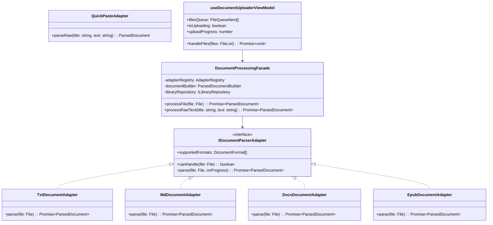

# SDD 01: Tier 1 — Documentos Essenciais (.txt, .md, .docx, .epub, Quick Paste)

> **Status:** Aprovado / Em Especificação  
> **Prioridade:** P0 (Fase Imediata)  
> **Padrões Aplicados:** MVVM, Facade, Adapters, Builder, SOLID & Services  
> **Componentes Afetados:** `src/lib/domain/`, `src/lib/parsers/`, `src/lib/facade/`, `src/hooks/`, `src/components/`  
> **Data:** Agosto de 2026  

---

## 1. Escopo e Justificativa

O **Tier 1** implementa a fundação da nova arquitetura com suporte aos formatos essenciais:
1. **`.txt` (Texto Puro):** Extração rápida e sanitização de quebras de linha.
2. **`.md` (Markdown):** Sanitização de tags e extração de capítulos a partir de cabeçalhos `# H1, ## H2`.
3. **`.docx` (Word):** Extração de parágrafos via `mammoth.js` com mapeamento de estilos para capítulos.
4. **`.epub` (Livros Digitais):** Extração estruturada de metadados, capa e capítulos via `JSZip`.
5. **Quick Paste (Entrada Direta):** Leitura de textos colados da área de transferência.

---

## 2. Estrutura de Classes e Padrões no Tier 1

---

## 3. Especificação Detalhada dos Componentes

### 3.1. [Model & Domain Services]
- **`src/lib/domain/document.types.ts`:** Tipos imutáveis `ParsedDocument`, `DocumentChapter`, `DocumentMetadata`, `DocumentFormat`.
- **`src/lib/domain/document-builder.ts` (`ParsedDocumentBuilder`):**
  - Construtor fluente para criar `ParsedDocument`.
  - Valida consistência de índices (`startIndex <= endIndex`).
  - Calcula automaticamente `wordCount` e `estimatedReadingMinutes`.
- **`src/lib/domain/sentence-splitter.service.ts` (`SentenceSplitterService`):**
  - Serviço puro com regex avançado para divisão de sentenças em português/inglês respeitando abreviações (ex: "Dr.", "Sr.", "etc.", "R$ 10,00").
- **`src/lib/domain/reading-metrics.service.ts` (`ReadingMetricsService`):**
  - Cálculo de métricas de leitura com base na velocidade média de fala (WPM).

---

### 3.2. [Adapters de Parsers]
- **`src/lib/parsers/txt.adapter.ts` (`TxtDocumentAdapter`):**
  - Implementa `IDocumentParserAdapter`.
  - Leitura via `FileReader.readAsText()`.
  - Sanitização de quebras `\r\n`.
- **`src/lib/parsers/md.adapter.ts` (`MdDocumentAdapter`):**
  - Identifica títulos `# H1`, `## H2` para gerar `DocumentChapter[]`.
  - Converte links `[link](url)` em texto falado.
- **`src/lib/parsers/docx.adapter.ts` (`DocxDocumentAdapter`):**
  - Extrai parágrafos via `mammoth.extractRawText()`.
  - Preserva hierarquia de seções.
- **`src/lib/parsers/epub.adapter.ts` (`EpubDocumentAdapter`):**
  - Descompacta `.epub` com `jszip`.
  - Extrai `META-INF/container.xml`, `.opf` e tabela de conteúdos (TOC).
  - Mapeia cada capítulo do livro digital para `DocumentChapter`.

---

### 3.3. [Facade & Registry]
- **`src/lib/parsers/adapter-registry.ts` (`AdapterRegistry`):**
  - Registra a lista de adapters ativos.
  - Método `getAdapterFor(file: File): IDocumentParserAdapter`.
- **`src/lib/facade/document-processing.facade.ts` (`DocumentProcessingFacade`):**
  - Ponto de contato único entre a UI/ViewModel e os extratores.
  - Orquestra: Escolha do Adapter -> Extração -> Builder -> Repositório IndexedDB.

---

### 3.4. [ViewModels (Hooks)]
- **`src/hooks/use-document-uploader.ts` (`useDocumentUploaderViewModel`):**
  - Gerencia o estado de upload múltiplo (fila de arquivos, progresso individual e status).
  - Dispara a Facade de processamento.
- **`src/hooks/use-document-reader.ts` (`useDocumentReaderViewModel`):**
  - Gerencia a sentença ativa, áudio TTS, velocidade, salto de capítulos e preferências.
- **`src/hooks/use-library.ts` (`useLibraryViewModel`):**
  - Gerencia a lista de documentos salvos no IndexedDB, filtros por formato e exclusão.

---

### 3.5. [Views (UI Components)]
- **`src/components/pdf-reader/document-dropzone.tsx`:**
  - Dropzone com `multiple={true}` e suporte a `.pdf, .epub, .docx, .txt, .md`.
  - Anotações WebMCP (`data-webmcp-tool="uploadDocument"`).
  - Totalmente acessível e responsivo a partir de 370px.
- **`src/components/pdf-reader/quick-paste-dialog.tsx`:**
  - Modal para inserção direta de texto.
- **`src/components/pdf-reader/library.tsx`:**
  - Exibição de cards com badges coloridos por tipo de formato.

---

## 4. Critérios de Aceitação e Testes

### 4.1. Testes Unitários com Jest
- `sentence-splitter.service.test.ts`: 100% de cobertura nos casos de borda de pontuação e abreviações.
- `document-builder.test.ts`: Validação de consistência do builder.
- `txt.adapter.test.ts`, `md.adapter.test.ts`, `docx.adapter.test.ts`, `epub.adapter.test.ts`: Testes com arquivos de fixture reais.
- `document-processing.facade.test.ts`: Testes de integração de orquestração com adapters mockados.

### 4.2. Testes de Integração e E2E com Cypress
- `cypress/e2e/multi-document-upload.cy.ts`:
  - Upload em lote de múltiplos formatos simultâneos.
  - Navegação entre capítulos em arquivos `.epub`.
  - Auditoria `cy.checkA11y()`.
