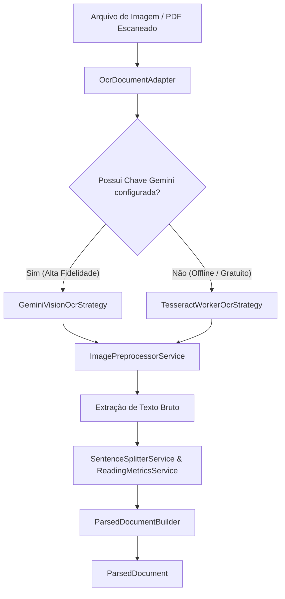

# SDD 03: Tier 3 — Multimodal e OCR (Imagens e Documentos Digitalizados)

> **Status:** Concluído / Implementado  
> **Prioridade:** P2 (Fase 3)  
> **Padrões Aplicados:** MVVM, Facade, Adapters, Builder & Strategy  
> **Componentes Afetados:** `src/lib/parsers/`, `src/lib/ocr/`, `src/components/pdf-reader/`  
> **Data:** Agosto de 2026  


---

## 1. Escopo e Objetivos

O **Tier 3** habilita o VivaVoz a ler materiais que não contêm camadas de texto digital selecionável, tais como:
1. **Fotos e Imagens (`.png`, `.jpg`, `.jpeg`, `.webp`):** Fotos de páginas de livros físicos, prints de apostilas, documentos impressos e anotações.
2. **PDFs Escaneados / Digitalizados:** PDFs formados exclusivamente por imagens escaneadas (onde os extratores padrão retornam zero texto).

---

## 2. Arquitetura de OCR Híbrida e Padrões de Projeto

Para suportar OCR com máxima flexibilidade e desacoplamento:
- **`OcrDocumentAdapter`:** Implementa `IDocumentParserAdapter`.
- **Strategy Pattern (`IOcrEngineStrategy`):** Permite alternar dinamicamente entre **Tesseract.js (Offline / WebWorker)** e **Gemini Vision (Cloud IA)**.
- **`ParsedDocumentBuilder`:** Monta o documento final a partir do texto extraído.



---

## 3. Especificação dos Módulos

### 3.1. Pré-Processamento de Imagem no Canvas (`image-preprocessor.service.ts`)
Antes de submeter a imagem ao motor de OCR, o navegador realiza otimizações para elevar a taxa de acerto:
1. **Redimensionamento:** Garante resolução adequada (DPI ideal entre 150 e 300 DPI).
2. **Conversão para Escala de Cinza (Grayscale):** Elimina ruídos de cor.
3. **Aumento de Contraste e Binarização (Otsu Thresholding):** Destaca o texto do fundo escuro ou manchado.

### 3.2. Estratégia Local: Tesseract.js (`tesseract-ocr.strategy.ts`)
- **Execução em WebWorker:** O processamento pesado roda em thread separada para não congelar a UI ou a reprodução de áudio.
- **Idiomas Suportados:** Download sob demanda dos modelos `por` (Português) e `eng` (Inglês) com cache no IndexedDB / CacheStorage.
- **Progresso Granular:** Emite eventos de progresso detalhados (`status: "loading_traineddata" | "recognizing_text"`, `progress: 0..100`).

### 3.3. Estratégia Cloud: Gemini Vision (`gemini-vision-ocr.strategy.ts`)
- Utiliza a chave da API Gemini configurada pelo usuário no [src/components/pdf-reader/gemini-key-dialog.tsx](file:///d:/project/viva-voz-text/src/components/pdf-reader/gemini-key-dialog.tsx).
- **Vantagem:** Reconhecimento superior de escrita à mão, fórmulas matemáticas e páginas com diagramas complexos em colunas.
- **Prompt Estruturado:** Instrução para retornar o texto em ordem natural de leitura, corrigindo hifens de quebra de linha.

### 3.4. Detector de PDFs Escaneados (`scanned-pdf-detector.service.ts`)
- Ao processar um PDF comum em `PdfDocumentAdapter`, se o total de caracteres extraídos for menor que 50 caracteres por página, o sistema identifica como "PDF Escaneado" e delega para o `OcrDocumentAdapter`.

---

## 4. Interface do Usuário (UI/UX) e ViewModel

### 4.1. ViewModel de OCR (`useOcrProcessingViewModel.ts`)
- Gerencia o estado de progresso granular (`"Carregando modelo..."`, `"Processando imagem: 68%..."`).
- Expõe métodos para alternar entre OCR local e IA em nuvem.

### 4.2. Indicador de Progresso e Modal de Revisão
- Exibição de progresso visual no Dropzone.
- Modal acessível WebMCP para validação prévia do texto extraído.

---

## 5. Critérios de Aceitação (BDD / INVEST)

### Cenário 1: Leitura de Foto de Página de Livro (.jpg)
```gherkin
Dado que o usuário arrasta uma foto "pagina-livro.jpg" para o dropzone
Quando o motor de OCR processar a imagem via OcrDocumentAdapter
Então o sistema deve converter a imagem em ParsedDocument estruturado
E exibir o badge "IMAGEM (OCR)" na biblioteca
E iniciar a narração por voz destacando cada frase reconhecida
```

### Cenário 2: PDF Digitalizado com Fallback de OCR
```gherkin
Dado que o usuário faz upload de um PDF escaneado de 3 páginas
Quando a extração de texto nativa retornar zero caracteres
Então o sistema deve acionar o fallback para OcrDocumentAdapter
E processar as 3 páginas via OCR progressivamente
```

---

## 6. Estratégia de Testes

### 6.1. Testes Unitários
- Teste do `image-preprocessor.service.test.ts` validando transformações em Canvas.
- Teste do `ocr-document.adapter.test.ts` validando a seleção da estratégia de OCR (Tesseract vs. Gemini).

### 6.2. Testes E2E (Cypress)
- Upload de imagem de teste `.png` contendo frase conhecida.
- Verificação da atualização da barra de progresso e áudio iniciado.
