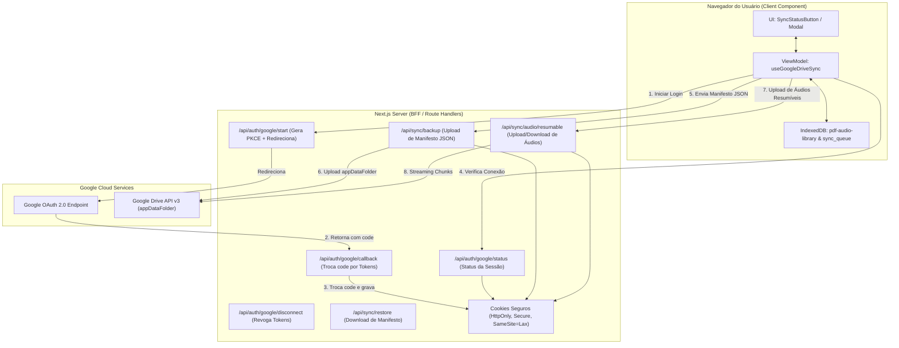

# SDD 04: Sincronização e Backup em Nuvem via Google Drive `appDataFolder` & BFF

> **Status:** Aprovado / Especificação Técnica Completa  
> **Versão:** 2.1.0  
> **Padrões:** Clean Architecture, GoF (Adapter, Facade, Repository, Strategy, Memento), OAuth 2.0 Authorization Code Flow + PKCE, Next.js BFF, HttpOnly Secure Cookies, Resumable Upload  
> **Data:** Agosto de 2026  

---

## 1. Visão Geral e Escopo

### 1.1. Contexto e Motivação
A aplicação **VivaVoz** utiliza persistência local no navegador via **IndexedDB** (`pdf-audio-library`), garantindo funcionamento *offline-first* para documentos processados, marcadores de leitura, histórico, preferências e blobs de áudio sintetizados (`AUDIO_CACHE_STORE`).

Para permitir backup seguro, sincronização transparente entre múltiplos dispositivos e proteção contra limpeza de cache, esta especificação estabelece o subsistema de **Sincronização em Nuvem** utilizando a área isolada **`appDataFolder`** da **Google Drive API v3**, orquestrada por um **BFF (Backend For Frontend)** em Next.js.

### 1.2. Segurança no Servidor e Zero Variáveis no Client (Sem `NEXT_PUBLIC_`)
Conforme as diretrizes de segurança do Next.js:
- **Nenhuma credencial ou segredo do Google é exposto ao cliente** (zero prefixo `NEXT_PUBLIC_`).
- Todas as variáveis de integração (`ENABLE_GOOGLE_DRIVE_SYNC`, `GOOGLE_DRIVE_CLIENT_ID`, `GOOGLE_DRIVE_CLIENT_SECRET`, `GOOGLE_DRIVE_REDIRECT_URI`) residem exclusivamente no servidor (`process.env.*`).
- O cliente interage com a Google Drive API apenas através dos endpoints do BFF.
- **IA Generativa 100% BYOK:** A narração TTS e o chat com documento utilizam exclusivamente a `userApiKey` fornecida pelo usuário no navegador, sem chaves de IA fixadas em variáveis de ambiente do servidor.

### 1.3. Decisão de Arquitetura: Sincronização Direta sem Atrito (Zero Passphrase)
- Por não lidar com dados altamente confidenciais, PII ou PCI, o sistema **não exige senhas mestras adicionais** do usuário.
- O backup é associado diretamente à conta Google do usuário com **1 clique**.
- A confidencialidade e integridade são garantidas nativamente por:
  1. **Isolamento da `appDataFolder`:** Visível e acessível exclusivamente pela VivaVoz.
  2. **HTTPS / TLS 1.3:** Proteção de dados em trânsito.
  3. **Criptografia em Repouso do Google (AES-256):** Proteção nos data centers do Google.
  4. **Cookies `HttpOnly` no BFF:** Proteção total contra XSS e sequestro de sessão.

---

## 2. Arquitetura da Solução (BFF + Google Drive)

---

## 3. Estrutura Modular de Arquivos no Google Drive (`appDataFolder`)

| Arquivo Remoto | Tipo | Estratégia de Upload | Descrição |
| :--- | :--- | :--- | :--- |
| `vivavoz_manifest.json` | JSON Estruturado | Multipart Upload (< 1MB) | Metadados de documentos, capítulos, progresso (`lastIndex`), marcadores e preferências de leitura. |
| `vivavoz_audio_<docId>.bin` | Binário Puro | Resumable Upload Chunked | Pacote consolidado contendo os blobs de áudio sintetizados (TTS) do documento `docId`. |

---

## 4. Endpoints do BFF (Route Handlers)

### 4.1. Iniciação (`/api/auth/google/start`)
- Gera `state` e salva em cookie temporário `vivavoz_oauth_state` (`httpOnly: true`, `maxAge: 300`).
- Redireciona para o Google com escopo `https://www.googleapis.com/auth/drive.appdata` e `access_type=offline`.

### 4.2. Callback (`/api/auth/google/callback`)
- Valida o `state` e troca o `code` por `access_token` + `refresh_token` no Google.
- Grava os tokens no cookie selado `vivavoz_gdrive_session` (`httpOnly: true`, `secure: true`, `sameSite: "lax"`, `maxAge: 30 dias`).
- Redireciona para `/` com parâmetro de sucesso.

### 4.3. Sincronização de Metadados (`/api/sync/backup` & `/api/sync/restore`)
- **`POST /api/sync/backup`:** Valida o JSON com schema Zod e faz upload/patch de `vivavoz_manifest.json` na `appDataFolder`.
- **`GET /api/sync/restore`:** Baixa o `vivavoz_manifest.json` para o cliente aplicar o merge inteligente no IndexedDB.

### 4.4. Upload Resumível de Áudios (`/api/sync/audio/resumable`)
- Inicia a sessão de Resumable Upload na Drive API v3 e faz streaming de chunks com atualização de progresso (0% a 100%) na UI.

---

## 5. Critérios de Aceite e Testes (DoD)

1. **Zero Exposição de Variáveis:** Nenhuma variável `NEXT_PUBLIC_GOOGLE_*` no código.
2. **Cookies `HttpOnly` Seguros:** Sessão persistida exclusivamente em cookies inacessíveis pelo JS do cliente.
3. **UX com 1 Clique:** Sincronização completa sem exigir senhas de criptografia.
4. **Resumable Audio Upload:** Suporte a arquivos de áudio pesados com barra de progresso.
5. **Cobertura de Testes:** Testes unitários com MSW e E2E no Cypress aprovados com **zero logs de erro**.
